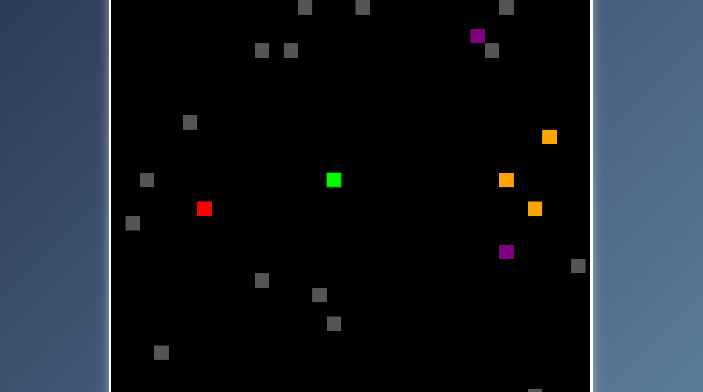

# Snake Game

A classic Snake Game built with **HTML**, **CSS**, and **JavaScript**, designed for both desktop and mobile browsers. This game is a modern twist on the classic, with vibrant colors, smooth animations, and additional features to make it more engaging!

---

## Features
- **Responsive Design**: Playable on both desktop and mobile devices.
- **Customizable Gameplay**: Snake speed and grid size can be adjusted.
- **Score Tracking**: Keeps track of the highest score during the session.
- **Modern Graphics**: Includes gradient backgrounds and animations for a visually appealing experience.
- **Local Storage**: High scores are saved, so you can try to beat your previous best!

---

## How to Play
1. Use arrow keys (or swipe gestures on mobile) to control the snake.
2. Eat the food to grow longer and score points.
3. Avoid colliding with the walls or your own tail.
4. Try to achieve the highest score possible!

---

## Controls
- **Desktop**: Use the arrow keys (`↑`, `↓`, `←`, `→`) to move the snake.
- **Mobile**: Swipe up, down, left, or right to control the snake's direction.

---

## Example


---

## Installation and Play
You can play this game directly in your browser!

1. Clone the repository:
   ```bash
   https://github.com/rexzea/game-ular-ssh.git

Preview
   ```bash
https://rexzea.github.io/game-ular-ssh/
